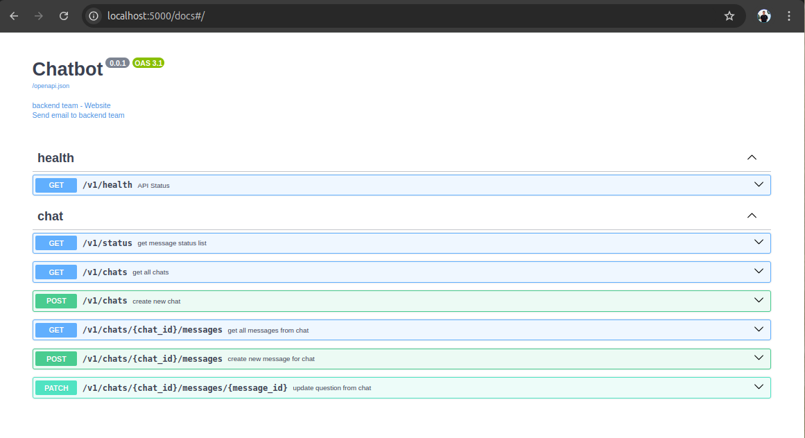

# 🚀 LLM ChatBot
An AI-powered chatbot to perform queries over a database, built using a Large Language Model (LLM).
This chatbot is containerized and ready to run with just Docker and Docker Compose.

## 📌 Features
- 🏗️ Easy Setup: No manual installation—just run Docker!
- 🚀 Fast Deployment: Ready to go in seconds.
- 🛠 Scalable & Portable: Run it anywhere with Docker.
- 🔌 API-Driven: Exposes a REST API for chatbot interaction.

## 📦 Requirements
Make sure you have the following installed:

- Docker: [Install Docker](https://docs.docker.com/engine/install/)
- Docker Compose: [Install Docker Compose](https://docs.docker.com/compose/install/)

## 🏃‍♂️ Quick Start
Clone this repository:

```bash
git clone https://github.com/pjcopado/ucm-data-science-tfm.git
cd ucm-data-science-tfm
```

## 1️⃣ Build & Run
Build & Run the chatbot using Docker Compose:

```bash
docker compose up --build
```

This will:

- Pull/build the required Docker images.
- Start the chatbot server.

## 2️⃣ Check Running Containers
To verify that the chatbot is running:

```bash
docker ps
```

You should see a running container named `ucm-data-science-tfm`.

## 3️⃣ Interact with the Chatbot
Frontend is running in `http://localhost:3000`.

Go ahead and write your question!


## 4️⃣ Backend API
Backend API is running in `http://localhost:5000`.




## 5️⃣ LLM API
LLM API is running in `http://localhost:5001`.


